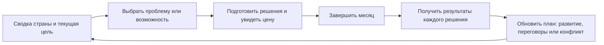

# Grand Strategy: игровой цикл и ближайшая версия

Дата: 2 октября 2026. Разбор версии `19b8eb410af065d481bd2717a189079707f2741e`.

Это мини-документ для обсуждения и следующей разработки. Раздел «Сейчас» описывает найденное в коде; остальные разделы предлагают изменения. Новые механики ещё не реализованы. Браузерный сеанс и партии с живым ИИ не проводились: визуальная оценка основана на разметке, стилях и обработчиках. Внешние источники прочитаны через публичные репозитории; это ограниченный обзор, а не исследование всего рынка.

## Идея игры

Игрок руководит страной и меняет историю через экономику, внутреннюю политику, дипломатию и войны. Нужны все эти направления, а не выбор одного вместо остальных. Их объединяет одна задача: **проводить свою политику, имея ограниченные средства и сталкиваясь с интересами других участников**.

Отличие проекта — возможность сформулировать собственный приказ и вести переговоры обычным языком. Карта делает последствия пространственными, а хроника превращает их в историю страны. Свободный ввод стоит сохранить вместе с понятными способами действий и проверяемыми результатами.

Экономика оплачивает реформы и армию; реформы меняют общественную поддержку; дипломатия позволяет получать преимущества и избегать затрат; война меняет ресурсы, границы и внутреннюю устойчивость. Именно связь между этими системами должна давать желание сделать следующий ход.

## Сейчас: что уже работает и почему цикл неясен

Есть содержательный фундамент: бюджет, долг, инфляция, ВВП провинций, налоги сословий, социальные расходы, законы, лояльность, договоры, войны, расчёт сражений, смена власти и сохранения.

Текущий цикл выглядит так:

```text
Выбрать страну → искать сведения в панелях → написать произвольные приказы
→ пропустить время → прочитать новости и изменения → придумать следующий приказ
```

| Найденное в коде | Что это означает для игрока |
|---|---|
| Приказ в `addAction()` — строка в массиве, без цены, срока и статуса | «Действие добавлено» не объясняет, что именно будет исполнено |
| Новая партия начинается без стартового задания или обзора проблем | Игроку трудно понять, чего добиваться первым ходом |
| Экономическая панель до первого месяца просит сделать ход | Первое решение приходится принимать без полноценного бюджета |
| Налоги, расходы и реформы преимущественно задаются текстом; панели в основном показывают состояние | Игрок должен угадать формулировку команды, а не увидеть доступный выбор |
| Экономический советник только отвечает текстом | Подсказка панели о смене налогов «советом экономиста» вводит в заблуждение: совет сам не выполняет приказ |
| «Доход» сверху — валовые поступления, а не итог бюджета после расходов | Положительный доход может соседствовать с дефицитом и ростом долга |
| Обычный месяц запрашивает 10 мировых и 3 внутренние новости | Длинная хроника заслоняет важные последствия своих решений |
| Числовые изменения не привязаны к отдельному приказу | Неясно, что изменилось из-за игрока, экономики или самостоятельного события |
| Неделя, месяц и несколько лет используют разные интервалы расчёта | Игрок не видит заранее, какие последствия наступят за выбранный срок |

В `nextTurn()` экономика и дата изменяются **до** генерации событий. Ответ ИИ затем может менять показатели, законы, территории и лидеров через `EFFECTS`. Ограничители и проверка отдельных значений существуют, но полного протокола выполнения приказов нет.

Есть риск потери приказов при сбое: `askGemini()` может вернуть текст ошибки, разбор событий принимает его как текст, отсутствие `EFFECTS` не блокирует завершение, а `onTurnEnd()` очищает очередь приказов. Это установленный путь по коду; сбой с живым API здесь не воспроизводился.

Проверить перед балансировкой:

- Экономист описывает старый бюджет, включая другие проценты и пороги; активный `econ.js` считает внутренний долг под 0,4%/мес, внешний — от 0,6% с риском. Советы должны выводиться из действующих правил.
- `resolveBattle()` использует общую армию и стабильность стран, а не численность конкретных маркеров на карте. Карта создаёт ожидание тактического управления, которого этот расчёт пока не обеспечивает.
- Визуальная карта замыкается по горизонтали, а `countryDistance()` использует обычную разницу координат. Видимое соседство через Тихий океан не соответствует оценке расстояния движком.
- В свободных сценариях `getRealismRules()` всё равно требует только реальную историю. Режим реализма следует хранить в данных сценария.

Код для дальнейшей работы: [game.js](../game.js) — `nextTurn`, `stepOneMonth`, `resolveBattle`; [ai.js](../ai.js) — `addAction`, `generateEvents`, `parseAndApplyEffects`, `sendDiplomacy`; [econ.js](../econ.js) — `econSimulateCountry`, `setLawSlot`; [ui.js](../ui.js) — экономическая и общественная панели.

## Предлагаемый основной цикл



Базовая единица обучения и балансировки — **один месяц**. В начале месяца игрок видит ближайшие угрозы, состояние бюджета и продвижение к своей цели. Обычно достаточно 1–3 содержательных решений, но это рекомендация по темпу, а не обязательный запрет свободных приказов.

У каждого подготовленного действия должны быть:

- предмет решения и адресат: конкретная страна, группа общества или территория;
- разовая цена и новые регулярные расходы;
- срок, условия и ожидаемая польза;
- риски и заинтересованные стороны;
- статус: подготовлено, выполняется, завершено, отклонено или сорвано.

Точность зависит от механики: известную бюджетную цену показывать числом, вероятность не выдавать за факт. Скрытую силу чужой страны показывать оценкой разведки с указанием неопределённости.

После месяца сначала показать **результат своих решений**, затем важные события мира. Формат результата: «приказ → что исполнено → что изменилось → почему → что можно сделать дальше». Не выполненное действие получает причину и следующий шаг.

### Пример месяца

Обнаружен дефицит. Игрок выбирает между повышением налога, сокращением содержания армии и сохранением расходов за счёт займа. В каждом варианте есть выгода и цена: деньги против лояльности, безопасности или будущих процентов. Параллельно можно договориться с соседом о ненападении, чтобы сделать сокращение армии приемлемым.

После хода отчёт показывает новый баланс, реакцию затронутых групп, статус переговоров и выполненные приказы. Следующая проблема возникает из этих результатов. Числа и сроки в карточках рассчитывает движок, а не произвольная формулировка новости.

## Роли экономики, дипломатии, войны и ИИ

| Направление | Минимальный понятный выбор | Обязательная обратная связь |
|---|---|---|
| Экономика | Изменить налог, расходы или военное содержание | Прогноз бюджета, фактическая разница, реакция общества |
| Внутренняя политика | Выбрать реформу из существующего слота или предложить свою | Сторонники, противники, цена перехода, сроки |
| Дипломатия | Пакт, союз, требование, предложение и свободное сообщение | Предложение имеет условия и состояние; согласие создаёт реальный договор |
| Война | Выбрать цель, выделить силы, задать направление | Силы связаны с армией страны, видны потери, прогресс и условия мира |
| Альтернативная история | Продолжить собственную линию решений | Хроника опирается на сохранённые факты и выполненные действия |

Готовые карточки облегчают первый ход. Поле «Свой приказ» остаётся полноценным способом управления.

ИИ полезен для понимания свободного текста, поведения собеседника, предложений и описания событий. Для исполняемого действия он предлагает структурированный план. Движок проверяет полномочия, средства, ограничения эпохи, сроки и допустимость результата. Игрок подтверждает важное решение, затем оно исполняется по правилам.

Для необычного приказа не нужно сразу обещать автоматическое исполнение всего: если механика ещё не поддерживает замысел, объяснить ограничение и предложить осуществимый вариант. Исторический текст не должен утверждать, что случилось то, чего нет в состоянии игры.

## Визуал и интерфейс

Существующее направление подходит идее: историческая карта, бумажные панели, флаги и портреты поддерживают ощущение управления государством. Просторная карта и одинаковые панели стран делают навигацию последовательнее. Сохраняем это направление.

Главная нехватка — визуализация **решений и изменения ситуации**, а не дополнительные украшения:

1. В сводке добавить итог бюджета и изменения показателей за последний месяц. Подробные семь показателей можно сохранить, но обозначить, какие сейчас требуют внимания.
2. Дать 2–3 коротких сигнала: «дефицит», «реформа вызывает сопротивление», «сосед готов к пакту». Нажатие ведёт к конкретному решению.
3. Показывать очередь исполнения, стоимость и сроки. На карте выделять территорию, к которой относится выбранное решение или событие.
4. В новостях сначала выводить короткий итог и значимые последствия; полную хронику раскрывать по желанию.
5. Портреты и сведения о правителях оставить в панели страны. Они не должны вытеснять управление и отчёт о последствиях.
6. Свести панели к одной палитре. Сейчас `renderEconomyPanel()` содержит текст `#e4decd` на светлой бумаге; для пары с `#fbf5e7` расчётный контраст около **1,24:1**, при ориентире 4,5:1 для обычного текста. Общество и законы также содержат остатки тёмной темы.
7. На телефоне сохранить одну рабочую панель и новости справа, на ноутбуке — несколько рабочих окон. Проверить реальную читаемость двух колонок общества внутри панели на 30%: одинаковая доля экрана не гарантирует достаточную ширину текста.

Нужен единый набор стилей для карточки, заголовка, предупреждения, показателя и результата действия. Сейчас несколько слоёв CSS переопределяют размеры и расположение: следующую доработку лучше начинать с устранения противоречащих правил, затем проверять телефон и ноутбук в браузере.

## Похожие игры: что взять для сравнения

Источники ниже прочитаны онлайн 2 октября 2026. Выводы в правой колонке — предложения для нашего проекта, а не утверждение, что мы воспроизвели опыт игры в браузере.

| Игра / проект | Что подтверждает источник | Урок для Grand Strategy |
|---|---|---|
| [Unciv](https://github.com/yairm210/Unciv/blob/master/README.md) | Развиваемая 4X для Android и ПК, модификации, обучение внутри игры | Сложная стратегия возможна на телефоне, если доступные действия и правила обнаруживаются в интерфейсе |
| [Принципы Unciv](https://github.com/yairm210/Unciv/blob/master/docs/Guiding-Principles.md) | ИИ преследует победу; минимальное число элементов с большим количеством взаимодействий | Развивать связи между имеющимися системами; реакции других стран должны следовать их интересам |
| [Freeciv-web](https://github.com/freeciv/freeciv-web/blob/develop/README.md) | Браузерная пошаговая стратегия: города, ресурсы, правительство и армия | Понятная цепочка «ресурс → решение → рост возможностей» важнее числа разделов |
| [Battle for Wesnoth — руководство](https://github.com/wesnoth/wesnoth/blob/master/doc/manual/manual.txt) | Цели сценария, победа и поражение, цена найма, содержание, сведения о движении и боевых шансах | Давать видимую цель, заранее объяснять цену и риск; взять ясность обратной связи, а не обязательно тактическую систему |
| [AI grand strategy MVP](https://github.com/SpacerOrg/ai-grand-strategy-mvp/blob/main/README.md) | README прототипа описывает 12 ходов, карточки политики, внешние действия, ресурсы и итог кампании; отдельный LLM-брифинг | Короткая проверяемая кампания помогает испытать цикл; текстовый ИИ можно отделить от расчёта. Качество реализации этого прототипа здесь не проверено |

Эти источники не покрывают весь жанр. Для следующего живого сравнения полезны также Victoria 3 (связь экономики и политики), Suzerain (цена политического выбора) и The Battle of Polytopia (темп и ясность мобильного хода). В этой итерации их страницы и игровые сеансы не исследовались; это список для дальнейшего просмотра.

## Ближайший прототип и порядок работ

Вначале собрать **одну законченную партию**, используя имеющиеся системы. Новые деревья технологий, десятки ресурсов и тактические подсистемы можно добавить после проверки цикла.

| Приоритет | Изменение | Как проверить |
|---|---|---|
| P0 | Исправить советы под действующий бюджет и согласовать термины/валюту/единицы | Объяснение советника совпадает с расчётной сводкой |
| P0 | Сохранять незавершённые приказы при ошибке ИИ; проверять ответ до фиксации результата | Повтор запроса не теряет приказ и не применяет один ход дважды |
| P1 | Стартовая сводка, бюджет до первого хода, выбираемая цель | Новый игрок может назвать ближайшую проблему и способ действия |
| P1 | Карточки налогов, расходов, реформ и договоров поверх существующих функций | Можно сделать осмысленный ход без знания формулировок промпта |
| P1 | Реестр приказов и краткий отчёт с причинами изменений | У каждого принятого решения виден результат или следующий срок |
| P2 | Понятная цель войны и связь выделенных сил с расчётом боя | Невозможно получить победу только красивым текстом о передвижении маркера |
| P2 | Привести контраст и компоненты к единому стилю | Читается на телефоне и ноутбуке без перекрытий и обязательного зума интерфейса |

Для первой проверки достаточно 10 месяцев на малой, средней и большой стране. Обязательно проверить конфликт интересов: краткосрочно выгодное действие должно иметь понятную цену, а не быть всегда лучшим.

Стратегическую цель игрок выбирает сам: восстановить бюджет, провести реформу, обеспечить безопасность или расширить влияние. Прогресс виден постоянно. Короткий проверочный горизонт может быть 24 месяца; песочница остаётся доступной и после оценки результата.

Цели и возможности задаются данными сценария. Пороги сравниваются со стартовым состоянием и масштабом страны; названия держав не используются для исключений. Для будущих сценариев нужны режим реализма, валюта, допустимые действия, стартовые отношения и необязательные цели.

## Когда можно считать цикл понятным

Проверить с несколькими новыми игроками, не объясняя правила голосом:

- За первые две минуты игрок называет цель и одну проблему страны.
- До подтверждения действия понимает его цену, срок и основной риск.
- После хода может объяснить, что изменилось из-за его решения.
- За 10 месяцев использует внутреннюю политику и внешнее взаимодействие, видит связь с бюджетом и безопасностью.
- Может сознательно отложить решение или отказаться от него.
- Ошибка сервиса не уничтожает подготовленные действия.
- Те же правила действуют в пользовательском сценарии и для разных размеров страны.

Практический следующий шаг — **стартовая сводка + понятные карточки решений + отчёт исполнения**. Эта связка даст измеримый игровой цикл, сохранив свободу приказов и все направления игры.
